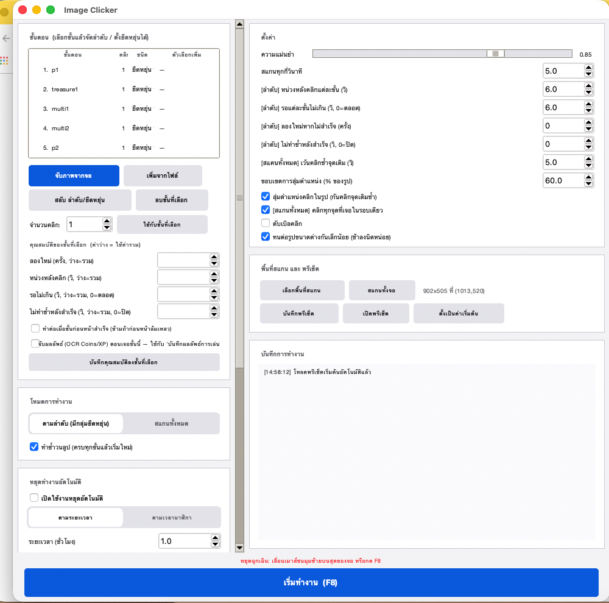

<p align="center">
  
</p>

<h1 align="center">Image Clicker</h1>
<p align="center">Watches your screen and clicks the right button automatically.<br>Built for grinding idle games in an Android emulator — works with any app.</p>

<p align="center">
  <a href="https://github.com/vizzerx/ImageClicker/releases/latest">
    
  </a>
</p>



## What it does

You capture snippets of your screen (a button, a popup, a result screen), and Image Clicker watches for them and clicks automatically:

- **Sequence mode** — click steps in order, with "flexible groups" for popups that can appear in any order
- **Scan-all mode** — click every match found on each pass
- **OCR results tracking** *(optional)* — reads Coins/XP off a result screen after each round, logs Round / Time / Elapsed to a table + CSV
- **Auto-stop timer** — stop after N hours or at a specific clock time, with a live countdown, plus a calculator that estimates total runtime from your average round time
- **Telegram reports** *(optional)* — periodic Coins/XP summaries sent to a Telegram bot, tagged with a per-host prefix if you run it on multiple machines
- **Presets** — save your whole setup (steps + captured images + settings) as a single file to reuse or share

## Download

1. **[Download the latest release](https://github.com/vizzerx/ImageClicker/releases/latest)**
2. Unzip the folder anywhere
3. Run `image_clicker.exe`

> Windows may show a SmartScreen warning since the exe isn't code-signed yet — click **More info → Run anyway**.

Only needed if you want the OCR results-tracking feature: install [Tesseract-OCR](https://github.com/UB-Mannheim/tesseract/wiki) (the default install location is detected automatically).

## How to use

1. Click **"จับภาพจากจอ"** (capture from screen) and drag a box around a button/image you want it to watch for — that becomes a step
2. Reorder steps with ▲ / ▼, or mark one as "flexible" if it can appear in any order (e.g. a random popup)
3. Pick a mode: **sequence** (with flexible groups) or **scan-all**
4. Adjust settings if needed — matching accuracy, scan interval, click delay, etc.
5. Press **"เริ่มทำงาน (F8)"** to start

Stop anytime with **F8**, or by moving your mouse to the top-left corner of the screen (emergency stop).

Full step-by-step guide (Thai): [README_วิธีใช้.txt](README_วิธีใช้.txt)

## Building from source

Requires Python 3.11+.

```bash
pip install -r requirements.txt
python image_clicker.py
```

The Windows exe is built via PyInstaller and GitHub Actions (see [.github/workflows/build-windows.yml](.github/workflows/build-windows.yml)) — pushing a `vX.Y` tag builds it and publishes a release automatically.
